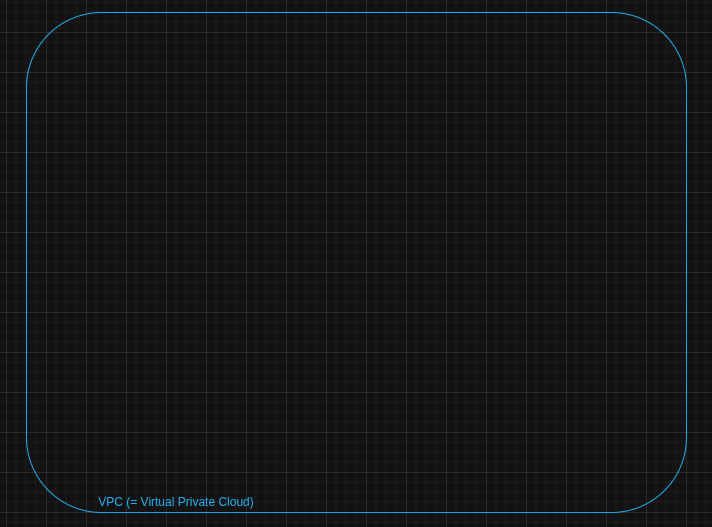

# Phase 0 - Design & Threat Model

L'objectif est de proposer une infrastructure qu'on va reviser au fur et à mesure, poser les fondations avant de coder.

## Schéma d'architecture de l'environnement hybride (AWS + Azure + lien hybride)

On va faire un schéma d'architecture pour notre environnement hybride.
Il faut savoir qu'il y a 2 ressources  cloud : AWS et Azure.
AWS est un cloud provider (= fournisseur de cloud) du même niveau que Azure, proposer par Amazon tandis que Azure est proposer par Microsoft.

### AWS

On va d'abord lister tout les matériaux/services qu'on va utiliser avec AWS.

#### VPC(= Virtual Private Cloud)

On a déjà le VPC, qui est un réseau privé cloud qui est par conséquent isoler des autres vpc privée ou public.
Prenons l'exemple d'un immeuble qui joue le rôle du fournisseur cloud, cet immeuble a plusieurs appartements, il existe alors plusieurs moyen de pouvoir se loger :
- collocataires dans un appartement dans le même immeuble, on peut y vivre à plusieurs, se partager l'appartement sans forcément avoir le droit ou le choix des personnes; on peut référencer ça au cloud public 
- appartement propre à toi, tandis que celui-ci il y a un appartement pour une seul et même personne, personne peut rentrer et y accéder sans autorisation donc celui du propriétaire.

Dans notre cas, nous allons faire un VPC pour tout isoler et créer notre propre cloud 

#### EC2
