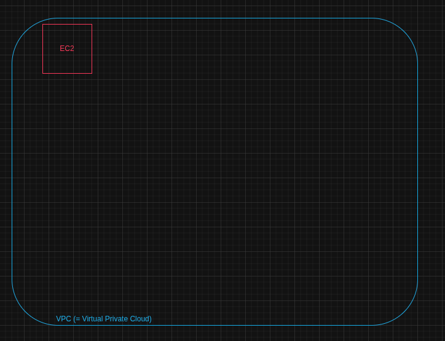

# Phase 0 - Design & Threat Model

L'objectif est de proposer une infrastructure qu'on va reviser au fur et à mesure, poser les fondations avant de coder.

## Schéma d'architecture de l'environnement hybride (AWS + Azure + lien hybride)

On va faire un schéma d'architecture pour notre environnement hybride.
Il faut savoir qu'il y a 2 ressources  cloud : AWS et Azure.
AWS est un cloud provider (= fournisseur de cloud) du même niveau que Azure, proposer par Amazon tandis que Azure est proposer par Microsoft.

### AWS

On va d'abord lister tout les matériaux/services qu'on va utiliser avec AWS.

#### VPC(= Virtual Private Cloud)

On a déjà le VPC, qui est un réseau privé cloud qui est par conséquent isoler des autres vpc privée ou public.
Prenons l'exemple d'un immeuble qui joue le rôle du fournisseur cloud, cet immeuble a plusieurs appartements, il existe alors plusieurs moyen de pouvoir se loger :
- collocataires dans un appartement dans le même immeuble, on peut y vivre à plusieurs, se partager l'appartement sans forcément avoir le droit ou le choix des personnes; on peut référencer ça au cloud public 
- appartement propre à toi, tandis que celui-ci il y a un appartement pour une seul et même personne, personne peut rentrer et y accéder sans autorisation donc celui du propriétaire.

Voici la composition d'un VPC:
- CIDR block = plage d'ip de tout le vpc, par exemple 192.168.0.0/16
- Subsnets = différents sous réseaux dans la plage d'ip du VPC donc dans le CIDR block, par exemple 192.168.10.0/24 et 192.168.20.0/24 qui sont 2 sous-réseaux différents qui vivent dans le même subnet/plage
- Internet Gateway (IGW) = l'endroit qui permet de rentrer/sortir du VPC depuis internet. Sans d'IGW aucun subnet n'est public comme aucun moyen d'y entrer et sortir à notre guise.
- Route table = définit où va le trafic, chaque subsnets a aussi sa propre table de routage ( si non elle utilise la table de routage par défaut du VPC), par exemple 192.168.10.0/24 veut ping google soit 8.8.8.8 , alors on fait une route avec une "entrée de route" qui indique que telle subnet peut envoyer un paquet à tels endroits pour le coup sa sera la cible qui est un id comme local ou igw-....
Paquet sort d'une instance dans subnet 192.168.10.0/24
  → destination = 8.8.8.8
  → le subnet est associé à rtb-abc123
  → dans rtb-abc123, 8.8.8.8 matche 0.0.0.0/0
  → cible = igw-0a1b2c3d
  → paquet part vers Internet   
- Security Group =  equivalent du pare-feu au niveau de l'instance 
- NACL = equivalent du pare-feu au niveau du subnet

Dans notre cas, nous allons faire un VPC pour tout isoler et créer notre propre cloud 

#### EC2 (= Amazon Elastic Compute Cloud)

Un EC2  est un service/ une instance proposer par Amazon .
C'est une machine virtuelle qu'on peut "louer" dans le AWS Cloud en spécifiant le matériel qu'on souhaite avoir que sa soit de la mémoire, de la puissance du calcul,...
Amazon propose par défauts plusieurs instances EC2 en fonction de ton besoin :
- CPU
- Memory
- Stockage
- Network
Ainsi que des familles :
- General Purpose = c'est un EC2 avec des ressources physiques equilibrer, les gens l'utilisent principalement pour faire des serveurs webs et faire du code 
- Compute Optimized = utiliser principalement pour faire tourner des gros serveurs de jeux et pouvoir faire de la modéliastion scientifique 
- Memory Optimized = utiliser pour avoir énormement de place dans la RAM 
- Accelerated  Optimized =  utiliser pour sa capacité de calculs comme l'optimisation de calculs, ou chercher dans des bases de données.
- Storage Optimized =  peut stocker énormément de données

Pour lancer une instance, on peut utiliser une IAM (Amazon Machine Image), comme dans la même optique que docker ce sont des images pré-fabriquer qqu'on peuet utiliser pour notre cas ce sont des VM pré-built donc avec une seule AMI on peut lancer plusieurs instances .

Dans notre cas l'EC2 se présente comme ça, une insatnce dans notre vpc :

#### S3