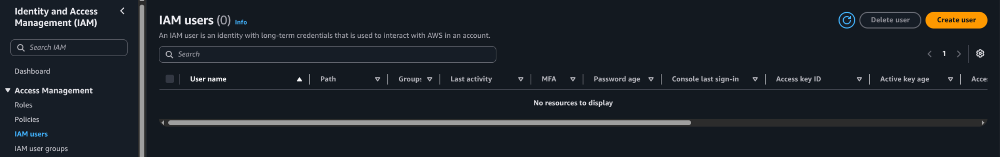
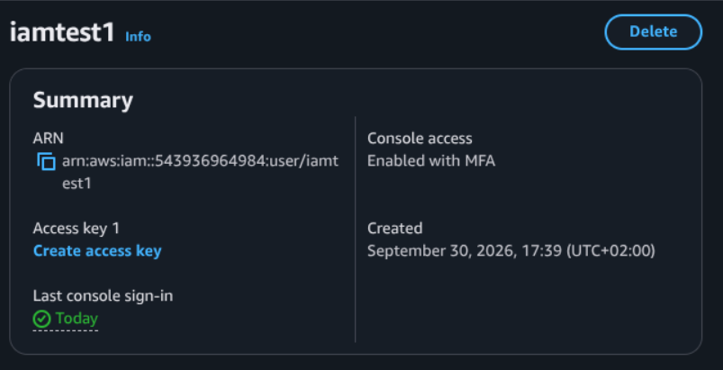
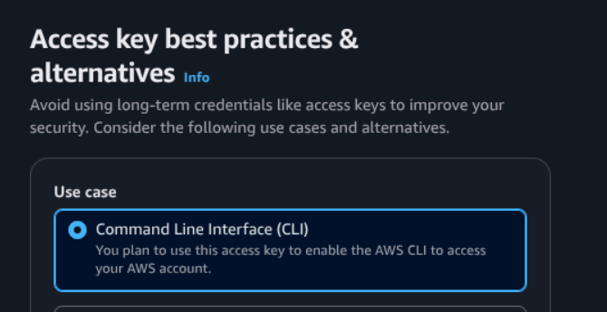

# Création de comptes

il existe un compte root et un compte iam, ne pas utiliser le compte root en production.
Evitez/voir jamais utiliser un compte à forts privilèges.
On l'utilise juste pour créer un compte IAM (Identity & Access Management)

## Compte Root

## Compte IAM

Un compte IAM sert à la gestion des users, grp, permissions,...

2 facons d'utiliser aws:
- Accéder à l'intaraface graphique / interface web
- Utiliser api en utilsant le terminale/cli (interface en ligne de commande ) qui permet de faire des actions via API
  
Faire l'auth multi-facteurs

Pour créer un compte IAM, on doit déjà avoir besoin du compte root.

On va sur la barre de recherche pour taper IAM, et on va sur IAM users > Create user et on se fait un compte
Et on vous faites les manips >>
créer un compte 
ajt console
	puis ajt sur des policies déja existantes == administrator access
ajt multifactor 
changez de mdp

On va créez une acces keys qui va me permettre d'accéder à l'API :

## Mis en place de AWS CLI

36:30